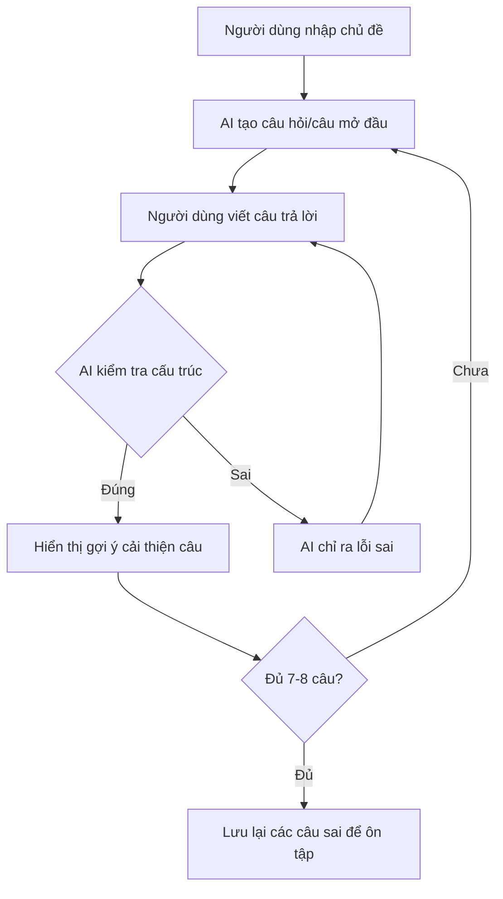

# English AI - Writing Feature

## Tổng Quan Dự Án

**English AI** là ứng dụng hỗ trợ học tiếng Anh thông qua AI. Phiên bản hiện tại tập trung vào tính năng **Writing** - giúp người dùng luyện viết câu đúng ngữ pháp.

---

## Mô Tả Tính Năng Writing

### 1.1 Luyện Tập Viết Câu

Tính năng này cho phép người dùng tự do viết câu tiếng Anh theo các chủ đề tự chọn.

### Luồng Hoạt Động

### Chi Tiết Tính Năng

| Bước | Mô Tả |
|------|-------|
| **1. Chọn chủ đề** | Người dùng tự nhập chủ đề hội thoại (VD: "đi chơi", "daily life", "shopping") |
| **2. AI khởi tạo** | AI tạo câu hỏi hoặc câu nói đầu tiên để bắt đầu hội thoại |
| **3. Người dùng viết** | Người dùng viết câu trả lời bằng tiếng Anh |
| **4. AI kiểm tra** | AI phân tích cấu trúc ngữ pháp của câu |
| **5a. Nếu đúng** | Hiển thị gợi ý cải thiện (improve) câu nói, chuyển sang câu tiếp |
| **5b. Nếu sai** | AI chỉ ra lỗi sai cụ thể, yêu cầu viết lại |
| **6. Hoàn thành** | Sau 7-8 câu, kết thúc hội thoại và lưu các câu sai |

### Yêu Cầu Kỹ Thuật

- **Độ dài hội thoại**: 7-8 câu/phiên
- **Lưu trữ lỗi**: Các câu trả lời sai được lưu lại để người dùng ôn tập sau
- **Gợi ý cải thiện**: Khi trả lời đúng, AI sẽ đề xuất cách viết hay hơn

---

## Tech Stack

| Thành Phần | Công Nghệ |
|------------|-----------|
| **Backend** | Node.js (Vercel Serverless Functions) |
| **Frontend** | Next.js (React) |
| **Database** | PostgreSQL (Vercel Postgres) |
| **ORM** | Prisma |
| **Deployment** | Vercel |
| **Architecture** | Microservices (API Routes) + Data Mesh |

---

## Mục Tiêu Dự Án

1. **Cải thiện kỹ năng viết**: Giúp người dùng viết câu tiếng Anh đúng ngữ pháp
2. **Học từ lỗi sai**: Lưu trữ và cho phép ôn tập các câu đã sai
3. **Nâng cao chất lượng**: Đề xuất cách viết hay hơn cho mỗi câu đúng
4. **Tương tác tự nhiên**: Tạo hội thoại giống thực tế qua các chủ đề đa dạng
