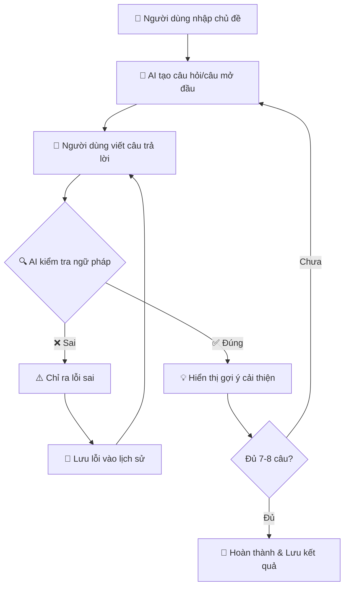
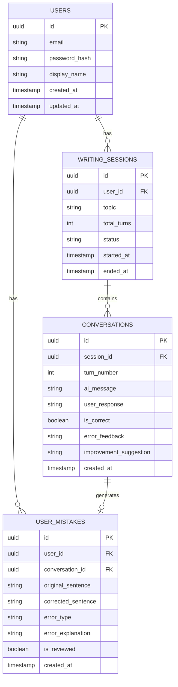

# 📚 English AI - Ứng Dụng Luyện Viết Tiếng Anh

## 1. Tổng Quan Dự Án

### 1.1. Mô Tả
**English AI** là một ứng dụng web hỗ trợ người dùng luyện tập viết tiếng Anh thông qua các cuộc hội thoại tương tác với AI. Ứng dụng giúp người dùng cải thiện kỹ năng viết câu đúng ngữ pháp, mở rộng vốn từ và học cách diễn đạt tự nhiên hơn.

### 1.2. Mục Tiêu
- Giúp người dùng **luyện tập viết câu tiếng Anh** theo các chủ đề tự chọn
- **Kiểm tra ngữ pháp** và cấu trúc câu theo thời gian thực
- **Đề xuất cải thiện** câu viết để người dùng học cách diễn đạt hay hơn
- **Lưu trữ lỗi sai** để người dùng có thể ôn tập và tránh lặp lại

### 1.3. Đối Tượng Sử Dụng
- Học sinh, sinh viên đang học tiếng Anh
- Người đi làm cần cải thiện kỹ năng viết tiếng Anh
- Bất kỳ ai muốn luyện tập viết tiếng Anh giao tiếp

---

## 2. Tính Năng Chi Tiết

### 2.1. 📝 Luyện Tập Viết Câu (Writing Practice)

#### Flow Hoạt Động:



#### Chi Tiết Từng Bước:

| Bước | Người Thực Hiện | Hành Động | Mô Tả |
|------|-----------------|-----------|-------|
| 1 | Người dùng | Nhập chủ đề | Ví dụ: "đi chơi", "daily life", "shopping" |
| 2 | AI | Tạo câu mở đầu | AI tạo câu hỏi hoặc câu nói đầu tiên để bắt đầu hội thoại |
| 3 | Người dùng | Viết câu trả lời | Người dùng viết câu tiếng Anh phản hồi |
| 4 | AI | Kiểm tra ngữ pháp | Kiểm tra cấu trúc câu, ngữ pháp, chính tả |
| 5a | AI (nếu đúng) | Gợi ý cải thiện | Đề xuất cách viết hay hơn, tự nhiên hơn |
| 5b | AI (nếu sai) | Chỉ ra lỗi | Giải thích lỗi và yêu cầu viết lại |
| 6 | Hệ thống | Lưu lỗi sai | Lưu các câu sai vào database để ôn tập sau |
| 7 | Hệ thống | Kết thúc | Sau 7-8 lượt, kết thúc phiên và lưu kết quả |

#### Ví Dụ Minh Họa:

```
👤 Người dùng: Chủ đề "Daily Life"

🤖 AI: "What time do you usually wake up in the morning?"

👤 Người dùng: "I wake up at 7 o'clock every day."

✅ AI: Correct! 
💡 Improvement: "I typically wake up at 7 AM every morning."

🤖 AI: "What do you usually have for breakfast?"

👤 Người dùng: "I eat bread and drink milk in breakfast."

❌ AI: Almost correct! 
⚠️ Error: "in breakfast" → "for breakfast"
📝 Correction: "I eat bread and drink milk for breakfast."

(Tiếp tục 5-6 câu nữa...)
```

### 2.2. 📊 Xem Lại Lỗi Sai (Mistake Review)

- Hiển thị danh sách các câu người dùng đã viết sai
- Cho phép lọc theo chủ đề, thời gian, loại lỗi
- Cung cấp bài tập ôn tập dựa trên các lỗi thường gặp

---

## 3. Yêu Cầu Kỹ Thuật

### 3.1. Tech Stack

| Layer | Technology | Mô Tả |
|-------|------------|-------|
| **Frontend** | ReactJS | Single Page Application |
| **Backend** | Java Spring Boot | Microservices Architecture |
| **Database** | PostgreSQL | Relational Database |
| **Deployment** | Railway | Cloud Platform |
| **Architecture** | Microservices + Data Mesh | Data as a Product |

### 3.2. Kiến Trúc Microservices

```
┌─────────────────────────────────────────────────────────┐
│                      Frontend (React)                    │
└─────────────────────────────────────────────────────────┘
                            │
                            ▼
┌─────────────────────────────────────────────────────────┐
│                     API Gateway                          │
│              (Spring Cloud Gateway)                      │
└─────────────────────────────────────────────────────────┘
                            │
        ┌───────────────────┼───────────────────┐
        ▼                   ▼                   ▼
┌───────────────┐   ┌───────────────┐   ┌───────────────┐
│Writing Service│   │ User Service  │   │  AI Service   │
│ - Sessions    │   │ - Auth        │   │ - Grammar     │
│ - Mistakes    │   │ - Profile     │   │ - Suggest     │
└───────────────┘   └───────────────┘   └───────────────┘
        │                   │                   │
        └───────────────────┴───────────────────┘
                            │
                            ▼
┌─────────────────────────────────────────────────────────┐
│                    PostgreSQL                            │
└─────────────────────────────────────────────────────────┘
```

### 3.3. Data Mesh Concept

> [!NOTE]
> **Data as a Product**: Mỗi service sở hữu và quản lý domain data của riêng mình.

| Domain | Service | Data Ownership |
|--------|---------|----------------|
| Writing | Writing Service | Sessions, Conversations, Mistakes |
| User | User Service | Users, Profiles, Preferences |
| AI | AI Service | Prompts, Suggestions cache |

---

## 4. Database Schema

### 4.1. Entity Relationship Diagram



### 4.2. Chi Tiết Bảng

#### Bảng `users`
| Column | Type | Description |
|--------|------|-------------|
| id | UUID | Primary key |
| email | VARCHAR(255) | Email đăng nhập |
| password_hash | VARCHAR(255) | Mật khẩu đã mã hóa |
| display_name | VARCHAR(100) | Tên hiển thị |
| created_at | TIMESTAMP | Thời gian tạo |

#### Bảng `writing_sessions`
| Column | Type | Description |
|--------|------|-------------|
| id | UUID | Primary key |
| user_id | UUID | FK → users.id |
| topic | VARCHAR(200) | Chủ đề hội thoại |
| total_turns | INT | Số lượt hội thoại (7-8) |
| status | ENUM | 'IN_PROGRESS', 'COMPLETED', 'ABANDONED' |
| started_at | TIMESTAMP | Thời gian bắt đầu |
| ended_at | TIMESTAMP | Thời gian kết thúc |

#### Bảng `conversations`
| Column | Type | Description |
|--------|------|-------------|
| id | UUID | Primary key |
| session_id | UUID | FK → writing_sessions.id |
| turn_number | INT | Lượt thứ mấy (1-8) |
| ai_message | TEXT | Câu hỏi/nói của AI |
| user_response | TEXT | Câu trả lời của người dùng |
| is_correct | BOOLEAN | Đúng ngữ pháp hay không |
| error_feedback | TEXT | Phản hồi lỗi (nếu sai) |
| improvement_suggestion | TEXT | Gợi ý cải thiện (nếu đúng) |

#### Bảng `user_mistakes`
| Column | Type | Description |
|--------|------|-------------|
| id | UUID | Primary key |
| user_id | UUID | FK → users.id |
| conversation_id | UUID | FK → conversations.id |
| original_sentence | TEXT | Câu gốc (sai) |
| corrected_sentence | TEXT | Câu đã sửa |
| error_type | VARCHAR(50) | Loại lỗi: GRAMMAR, SPELLING, STRUCTURE |
| error_explanation | TEXT | Giải thích lỗi |
| is_reviewed | BOOLEAN | Đã ôn tập chưa |

---

## 5. API Endpoints

### 5.1. Writing Service APIs

| Method | Endpoint | Description |
|--------|----------|-------------|
| `POST` | `/api/sessions` | Tạo phiên luyện tập mới |
| `GET` | `/api/sessions/{id}` | Lấy thông tin phiên |
| `POST` | `/api/sessions/{id}/respond` | Gửi câu trả lời |
| `GET` | `/api/sessions/{id}/history` | Lấy lịch sử hội thoại |
| `POST` | `/api/sessions/{id}/complete` | Kết thúc phiên |

### 5.2. Mistake Service APIs

| Method | Endpoint | Description |
|--------|----------|-------------|
| `GET` | `/api/mistakes` | Lấy danh sách lỗi sai |
| `GET` | `/api/mistakes/{id}` | Chi tiết một lỗi |
| `PUT` | `/api/mistakes/{id}/review` | Đánh dấu đã ôn tập |
| `GET` | `/api/mistakes/stats` | Thống kê lỗi sai |

### 5.3. AI Service APIs

| Method | Endpoint | Description |
|--------|----------|-------------|
| `POST` | `/api/ai/generate-question` | Tạo câu hỏi theo chủ đề |
| `POST` | `/api/ai/check-grammar` | Kiểm tra ngữ pháp |
| `POST` | `/api/ai/improve-sentence` | Gợi ý cải thiện câu |

---

## 6. Non-Functional Requirements

### 6.1. Performance
- Response time < 2 giây cho mỗi request
- AI response time < 5 giây

### 6.2. Security
- JWT Authentication
- HTTPS/TLS encryption
- Password hashing (BCrypt)

### 6.3. Scalability
- Microservices cho phép scale độc lập
- Database connection pooling

### 6.4. Availability
- Target uptime: 99%
- Railway auto-restart on failure

---

## 7. Glossary

| Thuật Ngữ | Định Nghĩa |
|-----------|------------|
| **Session** | Một phiên luyện tập viết (7-8 câu) |
| **Turn** | Một lượt hội thoại (AI hỏi → User trả lời) |
| **Improvement** | Gợi ý cải thiện câu viết hay hơn |
| **Mistake** | Lỗi sai được lưu lại để ôn tập |
| **Topic** | Chủ đề hội thoại do người dùng chọn |
